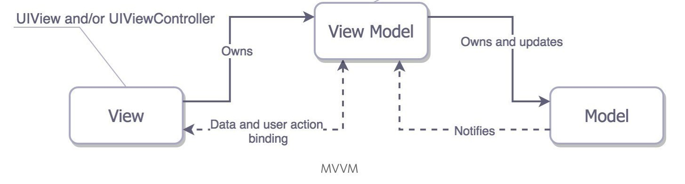
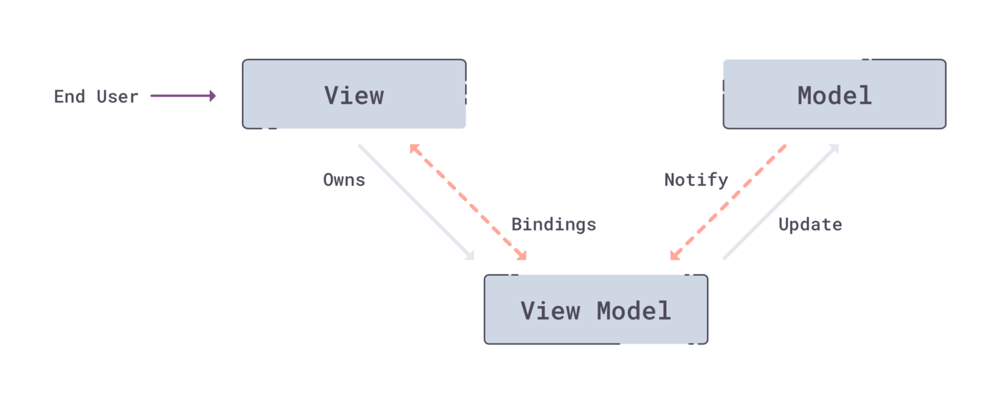

# MVVM + Coordinator + RxSwift 探索

## MVVM 简介

[MVVM 模式](https://en.wikipedia.org/wiki/Model–view–viewmodel) 和 [MVC 模式](https://en.wikipedia.org/wiki/Model–view–controller) 一样，主要目的是分离视图 `View` 和模型 `Model` 。它引入了 4 个主要概念:

- **M**odel  
模型是指代表真实状态内容的领域模型（面向对象），或指代表内容的数据访问层（以数据为中心）。

- **V**iew  
就像在 MVC 和 MVP 模式中一样，视图是用户在屏幕上看到的结构、布局和外观（UI）。在 iOS 中， MVVM 中的 View 指的是 View + ViewController。

- **V**iew**M**odel  
视图模型是暴露公共属性和命令的视图的抽象。MVVM 没有 MVC 模式的控制器，也没有 MVP 模式的 Presenter，有的是一个绑定器。在视图模型中，绑定器在视图和数据绑定器之间进行通信。

- Binder  
声明性数据和命令绑定隐含在 MVVM 模式中。如果用 Swift 开发 App,  `RxSwift` 就能很好的解决数据绑定。  
</br>



</br>


#### MVVM 优缺点

MVVM 有其优点，也有其缺点，并不是万能的。在项目中，需要根据实际情况来决定是否使用。

优点：

- `View controller` 轻量化。
- 视图与数据解耦。
- 代码的可测试性大大提高。

缺点：

- 缺少 `Router`  
界面的跳转需要自己实现，很多 MVVM 应用中被写进 `view controller` 中。

- `MVVM` 的 `controller` 和 `presentation layer` 定义模糊  
因为定义模糊，所以很多 `MVVM` 应用中的 `view model` 既负责协调网络层、数据层，同时也处理数据模型到可展示对象的转换工作。


## Coordinator

由于 `MVVM` 缺少 `Router` 进行界面跳转，所以这里我们引用了 [Soroush Khanlou 的 Coordinator](http://khanlou.com/2015/01/the-coordinator/) 的概念，由它来完成界面跳转。

我们先来看看 Coordinators 的全貌:

- 工作流程   


</br>

- 整体架构  


看了上面两个图，是不是觉得很优雅，很清晰。是的，不过代码实现起来还是挺费劲的，哈哈。

## RxSwift

RxSwift 是 [ReactiveX](http://reactivex.io) 的 Swift 版本，是一个可以帮助我们简化异步编程的框架。为什么要用它呢，因为好处太多了，以下大概列了下主要的好处：  

- 多个有依赖的异步任务代码调用非常简洁优雅，避免回调地狱。

- 等待多个异步任务并发完成，统一处理结果非常简洁优雅。

- 很好的完成 MVVM 中的 `View` 与 `ViewModel` 之间的数据流绑定。

关于 RxSwift 的使用，可以参照 [RxSwift 中文文档](https://beeth0ven.github.io/RxSwift-Chinese-Documentation/content/decision_tree/materialize.html)  和 [ReactiveX](http://reactivex.io/documentation/observable.html) 。

## View Model

接下来，我们重点讨论下 MVVM 中非常重要的 `ViewModel`, 它扮演的是处理业务逻辑的角色，负责处理数据和为 `View` 提供展示数据。一般来说有几下几点要求：

- 可测试的，这样可以直接为 ViewModel 编写单元测试。

- 不知道 ViewController 或者 View 的存在，只负责业务逻辑与处理数据。

- 团队编写 ViewModel 时需要严格按照现有规范来编写。

- 配合 RxSwift 使用更佳

### 数据绑定

对于 `View` 与 `ViewModel` 间的数据绑定，我觉得采用 `Inputs -> Outputs 和 Subject` 的组合方式来实现，既可以满足同步的需求，也可以满足异步的需求。`Subject` 需要根据实际业务情况来决定是否使用。

- Inputs  
是一组对 `ViewMode` 有影响的操作和事件，比如按钮上的tap操作，或者viewDidLoad事件。
  
- Outputs  
表示视图需要去响应的变化(如数据的改变)。
  
- Subject  
`Subject` 可以同时充当 `Observer` 和 `Observable`，所以我们就可以完全自由地选择何时提供输入、何时订阅输出了。

在任何情况下，ViewModel 在处理数据时都是单向流动的，即 Input 接受数据输入，Output 输出处理后的数据。但是如果 Output 里包含了 Subject ，ViewController 就可以通过调用 Ouput 相关 Subject 的 onNext 方法来达到输出数据的目的，这样数据流动就没有经过 ViewModel 进行处理了，这显然违背了 ViewModel 的设计原则，所以使用 Subject 时，需将对应的属性设置为私有。
  </br>


```swift
protocol ViewModelInputOutput {
    associatedtype Input
    associatedtype Output

    func transform(input: Input) -> Output
}
```

#### 一个实例

**ViewModel 实现**：  

```swift
//  FaceScanningViewModel.swift

import Foundation
import RxSwift
import RxCocoa

class FaceScanningViewModel: ViewModelInputOutput {
    
    struct Input {
        let cancelTrigger: Driver<Void>   // 当脸部扫描取消按钮被触发
        let scanningAreaChanged: Observable<CGRect>   // 视图 frame 变化后，引起扫描区域的变化
    }

    struct Output {
        let toast: Driver<String>  // 提示信息
        let faceScanned: Driver<AddFaceNameViewModel>  // 已经扫描到了人脸，创建标记人脸名字的 view model.
    }
    
    fileprivate let manager: CameraManager
    
    init(manager: CameraManager) {
        self.manager = manager
        super.init()
    }
    
    func transform(input: FaceScanningViewModel.Input) -> FaceScanningViewModel.Output {

        let api = manager.recognition
        let toastPublish = PublishRelay<String>()
        
        let box = Recognition.Box(trackId: 0, xRatio: 0, yRatio: 0, widthRatio: 0, heightRatio: 0)
        let invalidFace = Recognition.FaceScanned(id: -1, box: box, isExist: false, name: nil)
        
        let faceScanned = api.faceScanned.map { AddFaceNameViewModel(face: $0) }
            .asDriver(onErrorJustReturn: AddFaceNameViewModel(face: invalidFace))
        
        api.faceScanningFeedback
            .throttle(5.0, scheduler: MainScheduler.instance)
            .map { $0.message }
            .subscribe(onNext: { (message) in
                toastPublish.accept(message)
            }).disposed(by: rx.disposeBag)
        
        input.scanningAreaChanged
            .flatMapLatest { api.startFaceScanning($0) }
            .observeOn(MainScheduler.instance)
            .subscribe(onNext: { (_) in
                // 开始扫描
            }, onError: { (error) in
                toastPublish.accept(R.string.localizable.toastTurnOnFaceScanningFailure())
            }).disposed(by: rx.disposeBag)
        
        input.cancelTrigger.asObservable()
            .flatMapLatest { api.stopFaceScanning() }
            .subscribe(onNext: { (_) in
                
            }).disposed(by: rx.disposeBag)
        
        return .init(toast: toastPublish.asDriver(onErrorJustReturn: ""),
                     faceScanned: faceScanned)
    }
}
```

**视图绑定 ViewModel**:

```
import UIKit
import RxSwift
import RxCocoa

final class FaceScanningViewController: UIViewController {
      
   func bindViewModel() {
        super.bindViewModel()
        
        let input = FaceScanningViewModel.Input(
            cancelTrigger: navBar.leftButton!.rx.tap.asDriver(),
            scanningAreaChanged: scanningAreaChanged.asObservable()
        )
        let output = viewModel.transform(input: input)
        output.toast.drive(onNext: { (message) in
            Toast.show(message: message)
        }).disposed(by: rx.disposeBag)
        
        output.faceScanned.drive(onNext: { [weak self] (faceNameViewModel) in
            let addNameVC = AddFaceNameViewController(viewModel: faceNameViewModel)
            self?.navigationController?.pushViewController(addNameVC, animated: false)
        }).disposed(by: rx.disposeBag)
    }
}
```

#### Input/Output 命名规则

对所有输入和输出使用清晰，简洁和文字名称。理想情况下，视图应该能够直接通过变量名推断出:

- 触发输入动作  
- 输出应做什么

 例如，如果您要**输入**是`按钮被点击`，可以这样命名: `buttonTapped `；或者输入是`登陆按钮被点击`，也可以这样命名: `loginTrigger`。如果您的**输出**是`显示错误消息提示`，则将输出命名为: `showErrorMessage`。 

#### Tips

- `ViewModel` 坚决不引用 UIKit 相关类， 跟 view, view controller 完全解耦。
- `ViewModel`中的 `output` 如果有 `Subject`, `Subject` 需要隐藏，对 `View` 不可见。
- `Parent ViewModel` 负责创建 `ChildViewModel`。
- 充分理解业务，才能写出优雅清晰的 `ViewModel`。

## 项目实战

最后，我们结合 MVVM，Coordinator 和 RxSwift 来进行一个纯 MVVM 的小项目。实现过程我就不在这里详细的阐述了，直接上代码，代码才是王道，哈哈。

[MVVM + Coordinator + RxSwift 项目实战]()

## Reference

[RxSwift 中文文档](https://beeth0ven.github.io/RxSwift-Chinese-Documentation/content/decision_tree/materialize.html)  

[ReactiveX](http://reactivex.io/documentation/observable.html)  

[Soroush Khanlou 的 Coordinator](http://khanlou.com/2015/01/the-coordinator/)  

[iOS RxSwift + MVVM 如何构建ViewModel](https://www.jianshu.com/p/7663d995459f)  

[现有工程逐步使用 RxSwift 和 MVVM](https://dirtmelon.github.io/2019/09/03/migrate-to-rxswift-and-mvvm/)  

[搞定超级复杂性：MVVM，Coordinators和RxSwift](https://zhuanlan.zhihu.com/p/33757393)  


